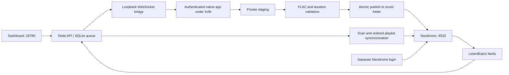

# PrivaMusic + SpotiFLAC Next + Navidrome

A Docker dashboard for Spotify tracks, albums and playlists, with a durable download queue, FLAC validation, automatic Navidrome playlist synchronization, and optional ListenBrainz scrobbling and discovery playlists.

## One-command deployment

From the repository root:

```sh
./deploy.sh
```

The command prepares the native app, generates credentials on first use, builds the images, starts both services, waits for health, and removes the old Cloudflare container when upgrading. Existing credentials, downloads, playlists, queue state, and native sessions are retained.

| Service | Default address |
| --- | --- |
| Dashboard | http://localhost:18780 |
| Navidrome | http://localhost:4533 |

Both ports bind to localhost by default. Each service has its own login. The same generated email/password works for both unless a separate Navidrome password was configured. Login details are written to `build/ACCESS.md` with private permissions. The dashboard's **Open library** link uses the current hostname and Navidrome's configured port. The generated login email defaults to `admin@example.com`; set `DASHBOARD_USER` in `.env` (or in the environment on the first run) to change it.

### Tailscale Services (optional)

The dashboard and Navidrome can be published as [Tailscale Services](https://tailscale.com/docs/features/tailscale-services), each with a stable name, a Tailscale-issued HTTPS certificate, and no port in the address:

| Service | Address |
| --- | --- |
| Dashboard | `https://privamusic.<tailnet>.ts.net/` |
| Navidrome | `https://navidrome.<tailnet>.ts.net/` |

One `tailscale/tailscale` sidecar joins the tailnet as a tagged node (`privamusic-host` by default) and advertises both services, proxying to the containers over the Compose network in userspace mode. Nothing in the repository or `.env` names the tailnet: Tailscale assigns the names, the deploy script prints them, and the dashboard's **Open library** link derives Navidrome's name from the address you are visiting.

One-time setup in the Tailscale admin console:

1. In the policy file, add a tag the node will use and allow it to host the services. Adjust the tag and who may reach the services:

   ```json
   "tagOwners": {"tag:privamusic": ["autogroup:admin"]},
   "grants": [{"src": ["autogroup:member"], "dst": ["svc:privamusic", "svc:navidrome"], "ip": ["tcp:443"]}],
   "autoApprovers": {"services": {"svc:privamusic": ["tag:privamusic"], "svc:navidrome": ["tag:privamusic"]}}
   ```

   Without `autoApprovers`, approve the two services on the **Services** page after the first deployment.
2. Define the two services (Services > Define a service, or the API): names `svc:privamusic` and `svc:navidrome`, port `tcp:443`, tag `tag:privamusic`. Advertising before the definitions exist succeeds silently but the names do not resolve; restart the sidecar after defining them.
3. Generate a reusable auth key for `tag:privamusic` (Settings > Keys). Ephemeral off.
4. In `.env`, set `COMPOSE_PROFILES=tailnet` and `TS_AUTHKEY`, optionally the names (see `.env.example`), then run `./deploy.sh`.

A node that was previously enrolled with a plain machine name of the same label shadows the service name in MagicDNS; delete such machines in the admin console.

Node identity and the serve configuration persist in `build/tailscale/`, so the key is only used for enrollment, and renaming the tailnet needs no change. MagicDNS and HTTPS certificates must be enabled for the tailnet. Service hosts must be tagged nodes; user-identity nodes are refused.

`NAVIDROME_PUBLIC_URL` overrides the library link for any other reverse-proxy setup.

There is no public tunnel, library reverse proxy, or trusted-header authentication. Navidrome requires its own credentials on its dedicated port. `DASHBOARD_PORT`, `NAVIDROME_PORT`, and `BIND_ADDRESS` can be configured in `.env`.

### Prerequisites

- Linux x86_64, Docker Compose, Node 24+, npm, GCC, and Python 3. The dashboard frontend is built with Vite during `./deploy.sh`; the output in `dist/` is what the image ships.
- The SpotiFLAC Next AppImage, obtained separately; see [Obtaining SpotiFLAC Next](#obtaining-spotiflac-next). It is never committed to this repository.
- An authenticated SpotiFLAC Next application-data directory. On first deployment, the script detects `~/.local/share/spotiflac-next`. Alternatively, supply it with `NEXT_SESSION_DIR=/absolute/path ./deploy.sh`, or configure that setting in `.env`. The default fallback is `build/session`.

### Obtaining SpotiFLAC Next

The native downloader is [SpotiFLAC Next](https://github.com/spotbye/SpotiFLAC-Next), a separate prebuilt desktop application. Its author provides it to supporters of the SpotiFLAC project; it is not a public download. This project does not include, build, or redistribute it, and it has no affiliation with its author. Check that project's terms before use; it currently publishes no license file.

1. Support the author at [afkarxyz.gumroad.com/coffee](https://afkarxyz.gumroad.com/coffee). Supporters receive access to the SpotiFLAC Next downloads through a private supporter post; questions about access go to the author, not to this project.
2. Download the Linux x86_64 AppImage from that supporter access. Version 1.5.4 is the one verified with this project.
3. Place it in the repository root as `SpotiFLAC-Next.AppImage`. A `spotiflac-next.zip` containing a single AppImage also works, or point at any path with `NEXT_APP_ARCHIVE=/path/to/SpotiFLAC-Next.AppImage ./deploy.sh`.
4. Run `./deploy.sh`. The preparation step extracts the AppImage into the ignored `build/app/` directory and skips extraction on later runs. To upgrade, delete `build/app/` and rerun with the new file.

Both file names are ignored by Git so they cannot be committed by accident. Keep the AppImage out of forks, issues, and pull requests: it is the author's supporter-only release.

Stop the original app before reusing its session. Only one native instance should run for the account. For a fresh installation or an expired session, sign in to the dashboard and choose **Sign in to downloader**. This opens the native app’s normal login screen in your browser. The desktop HTTP and WebSocket routes require the dashboard session; VNC listens only on container loopback and add no published ports. Deployment does not create a native account or bypass its login.

Docker access is selected automatically: the scripts use Docker directly when available, otherwise `sudo docker`. This may prompt for the host password. The root `.env` contains the dashboard credentials and deployment settings.

## Architecture



The AppImage contains a compiled Wails/WebKit app, not backend source. `native/inject.c` adds a document-start script using WebKit's user-script API. It calls three existing native methods for Spotify metadata, track downloads, and progress. The binary remains intact and performs its normal authentication. This avoids coordinate-based GUI automation, but still depends on the supplied app's WebKit/Wails interface.

The bridge is authenticated with a per-start token and listens only on container loopback. The dashboard exposes no arbitrary native RPC, JavaScript evaluation, or session getters. Writes require a matching Origin; login is rate-limited. Navidrome's own authentication remains enabled, with no external-auth headers trusted.

## Queue and library behavior

- SQLite preserves the queue across restarts; interrupted work resumes.
- Downloads are staged outside the music directory, checked for FLAC audio and plausible duration, then published through a temporary file and atomic rename.
- Stable Spotify-ID filenames prevent duplicate files across imports. Readable music metadata stays embedded in the FLAC.
- Completed playlists trigger a Navidrome scan, exact disk-path matching, playlist creation/update, and order verification. Repeated tracks remain repeated entries.
- Provider failures remain visible per track. Partially available collections produce a playlist containing successful tracks and are marked partial.
- Cancel stops after the current track and synchronizes the collected portion. Retry reuses valid files and updates the same saved playlist ID.
- A native timeout/disconnect halts the worker to prevent overlapping downloads. Restart the dashboard and retry the failed job.

`ND_SUBSONIC_DEFAULTREPORTREALPATH=true` enables exact matching for newly registered clients. With an older Navidrome database, enable **Report real path** for the `privamusic-next` player in its settings if needed.

## ListenBrainz scrobbling and discovery

Two optional features connect the stack to [ListenBrainz](https://listenbrainz.org): Navidrome scrobbles what you play, and the dashboard imports the playlists ListenBrainz generates from those listens (**Weekly Jams**, **Daily Jams**, **Weekly Exploration**), downloads the tracks, and keeps one Navidrome playlist per feed up to date. Both are off until configured.

### Scrobbling

Navidrome has a built-in ListenBrainz scrobbler; the stack only needs to switch it on. Last.fm and Deezer stay disabled, so ListenBrainz remains the only external service Navidrome talks to.

1. In `.env`, set `LISTENBRAINZ_SCROBBLE=true` and run `./deploy.sh`.
2. Copy your user token from [listenbrainz.org/settings](https://listenbrainz.org/settings/).
3. Open Navidrome, choose your user menu > **Personal**, enable **Scrobble to ListenBrainz**, and paste the token. Each Navidrome account links its own token.

Plays from the Navidrome web player and from any Subsonic client that reports playback are submitted as listens. Nothing is submitted for downloads.

### Discovery feeds

ListenBrainz publishes Daily Jams every day and Weekly Jams and Weekly Exploration every Monday, once your account has enough listens. The dashboard polls for new editions, maps each MusicBrainz recording to a Spotify track through the ListenBrainz Labs API, downloads what is missing through the normal queue, and publishes the result to Navidrome.

1. In `.env`, set `LISTENBRAINZ_USER` to your ListenBrainz user name. Add `LISTENBRAINZ_TOKEN` only if your generated playlists are private; the token is sent to `api.listenbrainz.org` and nowhere else.
2. Optionally narrow `LISTENBRAINZ_FEEDS` (default `weekly-jams,daily-jams,weekly-exploration`) or change `LISTENBRAINZ_CHECK_MINUTES` (default 120, minimum 15).
3. Run `./deploy.sh`. The **Discover** page shows each feed's latest edition, its import state, a link to the Navidrome playlist, and a **Check now** button; `node scripts/control.mjs discover` does the same from the shell.

How an edition is imported:

- Each new edition becomes a queue job of kind `listenbrainz`, listed under **Discover** with its own page, so progress, failures, retry and cancel work as for any collection.
- Recordings are mapped to Spotify by MusicBrainz ID first and by artist/release/title second. Recordings with no Spotify match are marked **Skipped**, do not count as failures, and are left out of the playlist.
- Tracks already in the library are reused rather than downloaded again, matched by Spotify ID and by ISRC, so Weekly Jams (music you already listen to) mostly costs nothing. New tracks are downloaded into the same music folder with the same stable file names as every other download.
- The Navidrome playlist is named after the feed (`Weekly Jams`, `Daily Jams`, `Weekly Exploration`) and replaced in place when the next edition arrives; its comment records the edition and the ListenBrainz playlist URL. If you delete the playlist in Navidrome, the next edition creates a fresh one. Earlier editions stay in the dashboard's history and their files stay in the library.
- Daily Jams is around fifty tracks a day. With the ten-second spacing between downloads, a fully new edition takes well over ten minutes; set `LISTENBRAINZ_FEEDS=weekly-jams,weekly-exploration` if that is more than you want.

Weekly Exploration and Weekly Jams expire on ListenBrainz after two weeks; the dashboard keeps the last imported edition of each feed until a newer one is published.

## Upgrading from the nested layout

The application and Compose file now live at the repository root. When upgrading an existing checkout, move the ignored `next-stack/.env`, `next-stack/build/`, and any local session data to their corresponding root locations before running `./deploy.sh`. Replace an old root Spotify `.env` with the dashboard `.env`; keep a private backup if needed. Update `NEXT_SESSION_DIR` if it points inside the former directory.

The Compose project name remains `privamusic-next` to preserve the service identity. Redeploy from the root to recreate containers with the new bind-mount paths. Do not use `docker compose down -v` or delete persistent data during migration.

## Frontend development

The dashboard is a React 19 app built with Vite under `web/`. Pages live in `web/src/pages`, reusable pieces in `web/src/components`, state in `web/src/hooks` (session polling, toasts, job actions), and API, routing, pagination and presentation helpers in `web/src/lib`.

The app is multi-page with a sidebar. Each media type has its own section, and every collection has its own page:

| Route | Page |
| --- | --- |
| `/` | Overview: stats, active downloads, collections needing attention, recent additions, quick add |
| `/queue` | In-progress, needs-attention and finished tabs with the halted/cooldown state |
| `/playlists`, `/albums`, `/tracks` | Paginated lists per type with status filters and search |
| `/playlists/:id`, `/albums/:id`, `/tracks/:id` | One collection: artwork, progress, retry/cancel, Navidrome and Spotify links, and a paginated, filterable track table |
| `/add` | Add a Spotify link; opens the new collection's page |
| `/discover` | ListenBrainz feeds: latest editions, import state, Navidrome playlist links, manual check |
| `/discover/:id` | One imported edition, with skipped recordings shown beside downloaded tracks |
| `/downloader` | Native session login, service status, how it works |

Routing is history-based in `web/src/lib/router.js`; the server answers any extensionless path with the app shell, so links can be bookmarked and refreshed. Filters, search and the page number live in the query string. The downloader login page is a second entry that bundles the noVNC client. The app uses only system fonts and hashed assets so the server's strict Content Security Policy stays intact; all frontend packages are dev dependencies and nothing from `node_modules` ships in the image except `ws`.

```sh
npm run dev     # Vite dev server on http://localhost:5173, proxying /api and /native to a running dashboard on :18780
npm run build   # writes dist/, which src/server.mjs serves and the Dockerfile copies
```

Browser checks (`scripts/check-scroll.mjs`, `scripts/smoke.mjs`) run against the built output, so run `npm run build` first.

## Persistent data

| Path | Contents |
| --- | --- |
| `build/music/` | Finished FLAC files; read-only in Navidrome |
| `build/data/` | Queue database and download staging |
| `build/navidrome/` | Navidrome database, playlists, cache |
| `NEXT_SESSION_DIR` or `build/session/` | Native session, settings, FFmpeg tools |
| `.env` | Credentials and cookie signing secret |

Paths above are relative to the repository root. Back up these locations; keep credentials and session data private. None are included in Git or the image. Stopping the stack retains bind-mounted data.

## Checks and operations

From the repository root:

```sh
npm test
node scripts/control.mjs status
node scripts/control.mjs add 'https://open.spotify.com/playlist/5FwoQeE2v5BGBvNj4JvdWl'
node scripts/control.mjs discover
sudo docker compose ps
sudo docker compose logs --tail=50 dashboard
sudo docker compose down
```

`node scripts/check-ports.mjs` tests the separate ports, access controls, dashboard login, and Navidrome login in a browser. Install Playwright's Chromium first, or supply `CHROMIUM_PATH`. `node scripts/smoke.mjs` additionally submits a real track and checks download completion. Screenshots are saved in ignored `build/screenshots/`.

The preparation step requires its listed host tools and uses the host CA bundle when building the native runtime. The AppImage's service availability and authenticated session remain external dependencies; provider failures are not reported as successful downloads.

## Artwork and lyrics

Downloads request embedded covers and lyrics from the native app. Before Navidrome
scans, the worker fills missing artwork from the track's Spotify image and missing
lyrics from LRCLIB's exact metadata/duration lookup. Timed lyrics are preferred;
plain lyrics are used when timing is unavailable. Lyrics are embedded and saved
as matching `.lrc` sidecars. Existing artwork and lyrics are preserved. FLAC audio
is copied without re-encoding. A missing match does not fail the music download.
Navidrome prefers embedded artwork and sidecar lyrics.

To backfill existing completed downloads while the download queue is idle:

```sh
docker compose exec -T dashboard node src/backfill.mjs
```

This is safe to rerun: existing metadata is retained. The command writes counts
and per-track availability to `build/data/enrichment-report.json`, then requests
a full Navidrome scan. Source outages appear in the report and can be retried.

Native download requests are spaced at least ten seconds apart. A provider HTTP
429 pauses the whole queue with a persisted cooldown (one minute, then doubling
up to fifteen minutes). The same track is retried up to five times before the
job stops for manual retry. The dashboard displays the resume time; restarting
the container or submitting another job does not bypass the cooldown.
