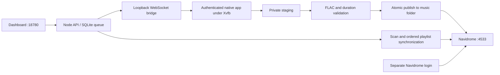

# PrivaMusic + SpotiFLAC Next + Navidrome

A Docker dashboard for Spotify tracks, albums and playlists, with a durable download queue, FLAC validation, and automatic Navidrome playlist synchronization.

## One-command deployment

From the repository root:

```sh
./deploy.sh
```

The command prepares the native app, generates credentials on first use, builds the images, starts both services, waits for health, and removes the old Cloudflare container when upgrading. Existing credentials, downloads, playlists, queue state, and native sessions are retained.

| Service | Default address |
| --- | --- |
| Dashboard | http://localhost:18780 |
| Navidrome | http://localhost:4533 |

Both ports bind to localhost by default. Each service has its own login. The same generated email/password works for both unless a separate Navidrome password was configured. Login details are written to `next-stack/build/ACCESS.md` with private permissions. The dashboard's **Open library** link uses the current hostname and Navidrome's configured port.

There is no tunnel, public URL, library reverse proxy, or trusted-header authentication. Navidrome requires its own credentials on its dedicated port. `DASHBOARD_PORT`, `NAVIDROME_PORT`, and `BIND_ADDRESS` can be configured in `next-stack/.env`.

### Prerequisites

- Linux x86_64, Docker Compose, Node 24+, npm, GCC, and Python 3.
- The supplied `spotiflac-next.zip` in the repository root. This application archive is not committed; obtain it separately.
- An authenticated SpotiFLAC Next application-data directory. On first deployment, the script detects `~/.local/share/spotiflac-next`. Alternatively, supply it with `NEXT_SESSION_DIR=/absolute/path ./deploy.sh`, or configure that setting in `next-stack/.env`. The default fallback is `next-stack/build/session`.

Stop the original app before reusing its session. Only one native instance should run for the account. For a fresh installation or an expired session, sign in to the dashboard and choose **Sign in to downloader**. This opens the native app’s normal login screen in your browser. The desktop HTTP and WebSocket routes require the dashboard session; VNC listens only on container loopback and add no published ports. Deployment does not create a native account or bypass its login.

Docker access is selected automatically: the scripts use Docker directly when available, otherwise `sudo docker`. This may prompt for the host password. The existing root Spotify `.env` is separate and is not changed.

## Architecture



The supplied ZIP contains a compiled Wails/WebKit app, not backend source. `native/inject.c` adds a document-start script using WebKit's user-script API. It calls three existing native methods for Spotify metadata, track downloads, and progress. The binary remains intact and performs its normal authentication. This avoids coordinate-based GUI automation, but still depends on the supplied app's WebKit/Wails interface.

The bridge is authenticated with a per-start token and listens only on container loopback. The dashboard exposes no arbitrary native RPC, JavaScript evaluation, or session getters. Writes require a matching Origin; login is rate-limited. Navidrome's own authentication remains enabled, with no external-auth headers trusted.

The earlier Go/Next.js stack remains separate. Its Spotify web-player metadata fallback is included, but its older audio-provider endpoints failed the original download test; the new stack uses the working authenticated native app.

## Queue and library behavior

- SQLite preserves the queue across restarts; interrupted work resumes.
- Downloads are staged outside the music directory, checked for FLAC audio and plausible duration, then published through a temporary file and atomic rename.
- Stable Spotify-ID filenames prevent duplicate files across imports. Readable music metadata stays embedded in the FLAC.
- Completed playlists trigger a Navidrome scan, exact disk-path matching, playlist creation/update, and order verification. Repeated tracks remain repeated entries.
- Provider failures remain visible per track. Partially available collections produce a playlist containing successful tracks and are marked partial.
- Cancel stops after the current track and synchronizes the collected portion. Retry reuses valid files and updates the same saved playlist ID.
- A native timeout/disconnect halts the worker to prevent overlapping downloads. Restart the dashboard and retry the failed job.

`ND_SUBSONIC_DEFAULTREPORTREALPATH=true` enables exact matching for newly registered clients. With an older Navidrome database, enable **Report real path** for the `privamusic-next` player in its settings if needed.

## Persistent data

| Path | Contents |
| --- | --- |
| `build/music/` | Finished FLAC files; read-only in Navidrome |
| `build/data/` | Queue database and download staging |
| `build/navidrome/` | Navidrome database, playlists, cache |
| `NEXT_SESSION_DIR` or `build/session/` | Native session, settings, FFmpeg tools |
| `.env` | Credentials and cookie signing secret |

Paths above are relative to `next-stack/`. Back up these locations; keep credentials and session data private. None are included in Git or the image. Stopping the stack retains bind-mounted data.

## Checks and operations

From `next-stack/`:

```sh
npm test
node scripts/control.mjs status
node scripts/control.mjs add 'https://open.spotify.com/playlist/5FwoQeE2v5BGBvNj4JvdWl'
sudo docker compose ps
sudo docker compose logs --tail=50 dashboard
sudo docker compose down
```

`node scripts/check-ports.mjs` tests the separate ports, access controls, dashboard login, and Navidrome login in a browser. Install Playwright's Chromium first, or supply `CHROMIUM_PATH`. `node scripts/smoke.mjs` additionally submits a real track and checks download completion. Screenshots are saved in ignored `build/screenshots/`.

The preparation step requires its listed host tools and uses the host CA bundle when building the native runtime. The AppImage's service availability and authenticated session remain external dependencies; provider failures are not reported as successful downloads.

## Artwork and lyrics

Downloads request embedded covers and lyrics from the native app. Before Navidrome
scans, the worker fills missing artwork from the track's Spotify image and missing
lyrics from LRCLIB's exact metadata/duration lookup. Timed lyrics are preferred;
plain lyrics are used when timing is unavailable. Lyrics are embedded and saved
as matching `.lrc` sidecars. Existing artwork and lyrics are preserved. FLAC audio
is copied without re-encoding. A missing match does not fail the music download.
Navidrome prefers embedded artwork and sidecar lyrics.

To backfill existing completed downloads while the download queue is idle:

```sh
docker compose exec -T dashboard node src/backfill.mjs
```

This is safe to rerun: existing metadata is retained. The command writes counts
and per-track availability to `build/data/enrichment-report.json`, then requests
a full Navidrome scan. Source outages appear in the report and can be retried.
